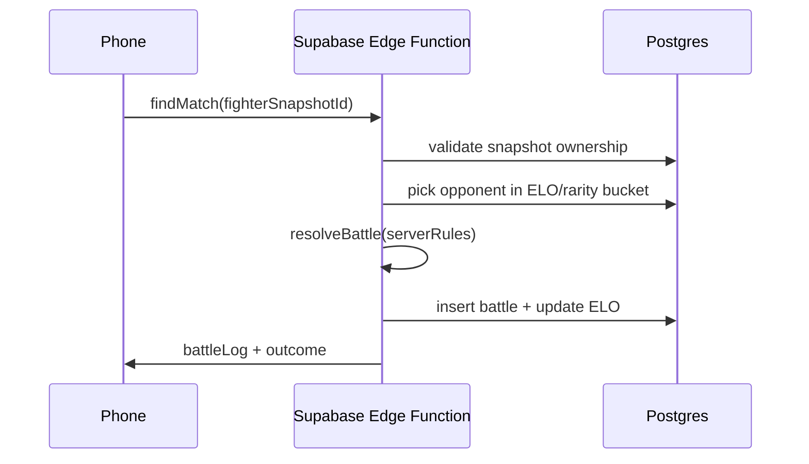

# PvP design (Phase 2)

Async, server-authoritative battles built on **Phase 1 cloud save** (stable `user_id`, trusted `game_saves` ownership).

## Goals

- Fun async “find opponent” without real-time sockets
- No client-reported combat stats or step counts
- Cross-platform (Android + iOS) using the same Supabase backend

## Prerequisites (Phase 1)

- User signed in (Apple / Google)
- Optional cloud backup enabled
- `game_saves` row with valid `CloudGameSave` v1

## Data model (new tables)

### `fighter_snapshots`

| Column | Type | Notes |
|--------|------|-------|
| `id` | uuid PK | |
| `user_id` | uuid FK | Owner |
| `species_id` | text | From roster |
| `egg_rarity` | text | Rolled rarity at hatch |
| `nickname` | text | Optional |
| `combat_power` | int | **Server-computed** from species tier + rarity |
| `elo` | int | Matchmaking rating |
| `created_at` | timestamptz | |

Snapshots are created when the player opts in from an **adult** creature in their verified save. Client sends `speciesId` + snapshot id request; server validates ownership against `game_saves.save_json`.

### `battles`

| Column | Type | Notes |
|--------|------|-------|
| `id` | uuid PK | |
| `player_a_snapshot_id` | uuid | |
| `player_b_snapshot_id` | uuid | |
| `winner_snapshot_id` | uuid | |
| `turn_log` | jsonb | Ordered events for client animation |
| `created_at` | timestamptz | |

## Match flow

1. Player taps **Find opponent** with a chosen fighter snapshot.
2. Edge function loads both snapshots, computes stats server-side.
3. Turn-based resolver runs (speed → attack order, damage caps, rarity modifiers).
4. Returns `turn_log` JSON; clients animate locally. Client sends only `matchId`, not damage.

## Combat rules (MVP)

- **Power** = `baseSpeciesTier * rarityMultiplier` (table in Edge function, not client).
- **HP** = fixed by rarity band.
- **Turns** = alternating attacks until one HP ≤ 0 (max 20 turns → tie-break by remaining HP).
- **No steps** in combat formulas.

## Matchmaking

- Bucket by `egg_rarity` ± one tier for queue time
- Prefer similar `elo` within bucket; expand after 10s wait
- Allow **ghost** matches against inactive snapshots

## Rewards (v1)

- Win streak counter (profile stat)
- Cosmetic titles later — avoid pay-to-win tied to steps

## Anti-cheat

- Never trust client-sent power, steps, or inventory
- Re-validate `game_saves.revision` when creating snapshots
- Rate-limit `findMatch` per user

## Out of scope for v1 PvP

- Real-time sockets / frame sync
- Cross-platform live battles
- Client-authored battle logs

## Rough effort

~3–5 weeks after cloud save is stable in production, depending on battle UX depth.
