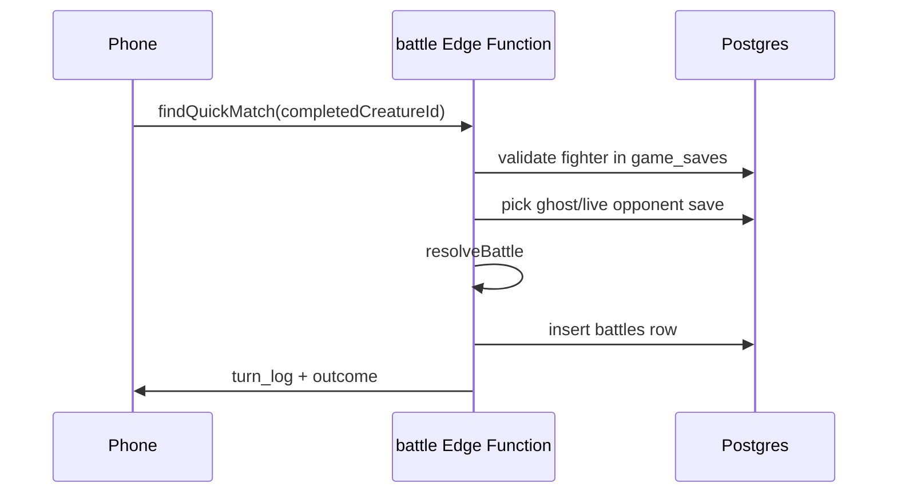
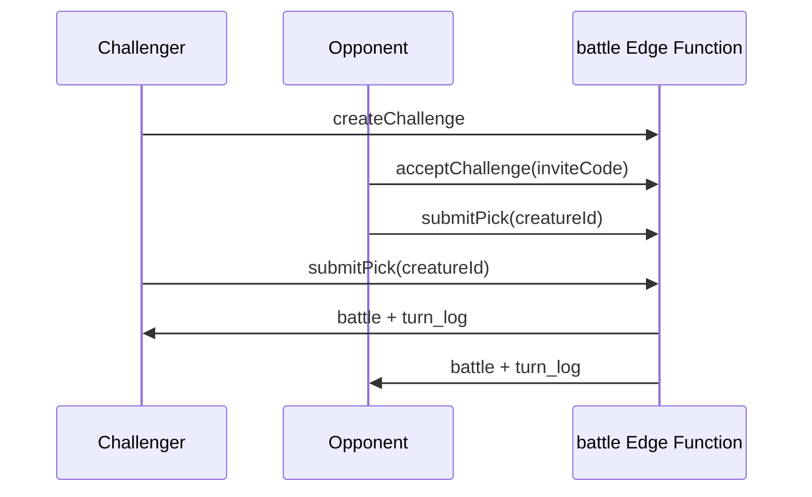

# PvP design (Phase 2)

Async, server-authoritative battles built on **Phase 1 cloud save** (stable `user_id`, trusted `game_saves` ownership).

## Goals

- Fun async battles: **quick matchmaking** and **friend challenges with blind pick**
- **Pack synergy**: duplicate species in your collection boost the one fighter you field
- **EX progression**: synced steps grow all completed adults passively (5% drip) while your active egg/dino gets 100%
- No client-reported combat stats or step counts
- Cross-platform (Android + iOS) using the same Supabase backend

## Prerequisites (Phase 1)

- User signed in (Apple / Google)
- Cloud backup enabled and `game_saves` row with valid `CloudGameSave` v2
- Deploy [`supabase/migrations/002_pvp.sql`](../supabase/migrations/002_pvp.sql) and Edge Function [`supabase/functions/battle`](../supabase/functions/battle/index.ts)

## Cloud save v2 (roster EX)

Each `completedCreatures[]` entry adds:

| Field | Purpose |
|-------|---------|
| `eggRarityAtHatch` | Egg rarity when claimed (combat bonus) |
| `exSteps` | Lifetime passive EX from step drip |
| `exLevel` | Derived 1–50 combat tier |

See [`CLOUD_SAVE_CONTRACT.md`](CLOUD_SAVE_CONTRACT.md).

### Step drip (client)

```
rosterDrip = floor(stepAmount * 0.05)
for each completedCreature:
    exSteps += rosterDrip
    exLevel = exLevelFromSteps(exSteps)
```

Active creature still receives 100% of synced steps.

## Combat power (server + client preview)

Single fighter per side. Pack bonus counts **all copies** of that `speciesId` in the player's save.

```
basePower      = speciesRarityTable[species.rarity]   // Common 100 … Legendary 280
eggBonus       = eggRarityTable[eggRarityAtHatch]     // 0 … 40
exBonus        = exLevel * 3
packMultiplier = 1 + min(packCount - 1, 3) * 0.15       // cap 1.45× at 4+ copies

combatPower    = floor((basePower + eggBonus + exBonus) * packMultiplier)
maxHP          = floor(combatPower * 1.2)
attack         = floor(combatPower * 0.35)
```

Clients show **estimated** power only; Edge Function recomputes from `game_saves.save_json`.

## Data model

### `player_profiles`

Invite code for friend challenges, optional ELO (default 1000).

### `battle_challenges` (friend blind pick)

| Status | Meaning |
|--------|---------|
| `pending` | Challenger waiting for opponent |
| `picking` | Both players choose fighter secretly |
| `complete` | Battle resolved |

Picks stored server-side; opponent pick hidden until both submitted.

### `battles`

Stores resolved quick matches and friend battles with `turn_log` JSON for client animation.

## Match flows

### Quick match



### Friend challenge (blind pick)

1. Player A taps **Challenge** → share invite code
2. Player B enters code, picks fighter (hidden)
3. Player A picks fighter (hidden)
4. When both picks locked → **Reveal** → battle animation



## Edge Function actions

| Action | Purpose |
|--------|---------|
| `ensureProfile` | Create/load invite code |
| `createChallenge` | Start friend challenge |
| `acceptChallenge` | Join via invite code |
| `joinChallenge` | Join via challenge id |
| `submitPick` | Blind fighter selection; resolves when both ready |
| `findQuickMatch` | Instant match vs ghost/live save |
| `listBattles` | Recent history |
| `getChallenge` | Poll challenge state (opponent pick hidden) |

## Client UI

- **Battle tab** (Android + iOS): fighter select, quick match, invite code, lock-in pick, results + history
- **Collection detail**: EX level, egg rarity at hatch, pack bonus preview

## Anti-cheat

- Never trust client-sent power, EX, pack count, or steps
- Validate `completedCreatureId` ownership against `game_saves`
- Push local save before battle pick so server has latest roster

## Rewards (v1)

- Win/loss in battle history
- ELO column reserved; tuning later
- No step or pay-to-win rewards

## Out of scope for v1 PvP

- Real-time live battles
- Multi-fighter teams (3v3) — pack bonus replaces this
- Trading dinos
- Cross-account linking (Apple vs Google)

## Deployment checklist

1. Run `002_pvp.sql` in Supabase SQL editor
2. Deploy function: `supabase functions deploy battle`
3. Enable cloud sign-in for testers (`signInEnabled` / `ACCOUNT_SIGN_IN_ENABLED`)
4. Verify `game_saves` rows include v2 `exSteps` / `eggRarityAtHatch`
